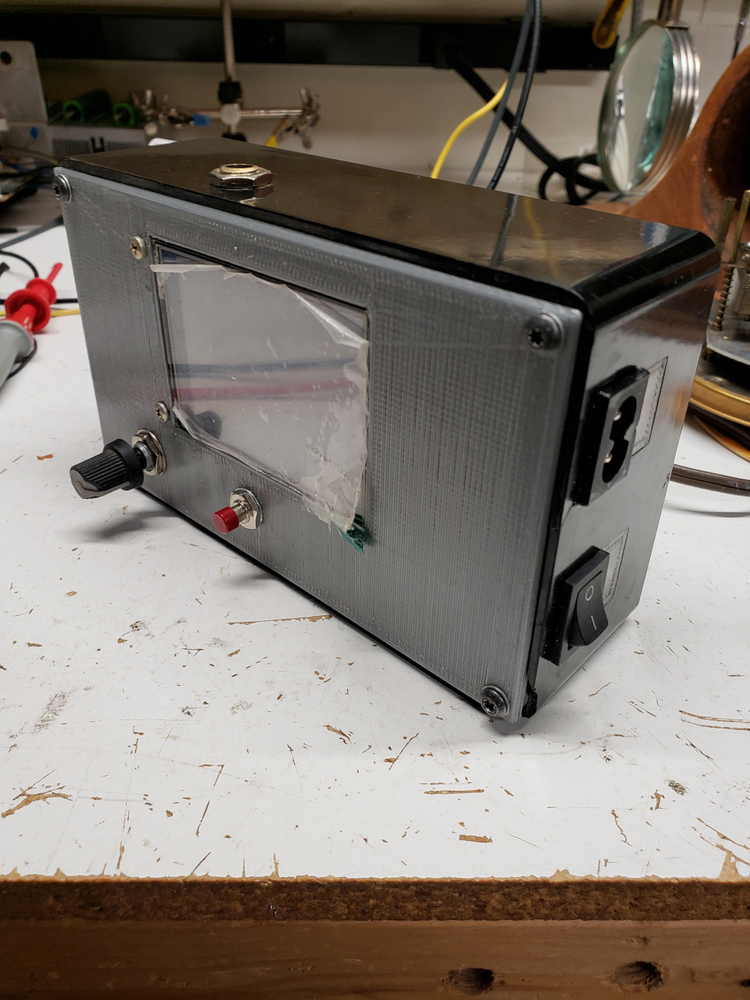

# sig_gen

An STM32F051R8T6 based function generator with a 320 X 240 TFT lcd (HX8347G lcd controller). 
I used the STM32F0 discovery board for this project.
For button debounce I used Trent Cleghorn's button debounce code. (https://github.com/tcleg/Button_Debouncer)
I wrote the code with Eclipse and the Gnu arm eclipse plug in.
Uses the TL081 op amp as a buffer to protect the DAC on the STM32.
The only thing I would maybe change is the way I displayed the waveform on the LCD.
Overall it works pretty well and I've used it quite a bit.

Features:
* Variable frequency via an encoder.
- 4 selectable waveforms via button select.

- Sine wave
- Triangle wave 
- Square wave
- Saw wave

